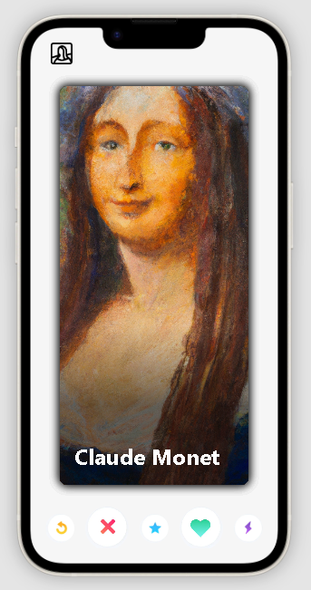

# Mona Lisa Tinder

## About
This repository contains a clone of Tinder where the cards feature AI-generated images of the Mona Lisa. The goal is for the user to choose their preferred artist style by liking or disliking the cards.

## Objective
The objective of this project is to provide users with a fun and interactive way to explore different artistic styles generated by AI. By swiping left or right on the cards, users can express their preferences and discover new AI-generated artworks.

## Features
- Swipe left to dislike an artwork.
- Swipe right to like an artwork.
- Explore various artistic styles generated by AI.
- Simple and intuitive user interface.

## Technologies Used
- HTML
- CSS
- JavaScript
- [DALL - E](https://labs.openai.com/)

## Preview

